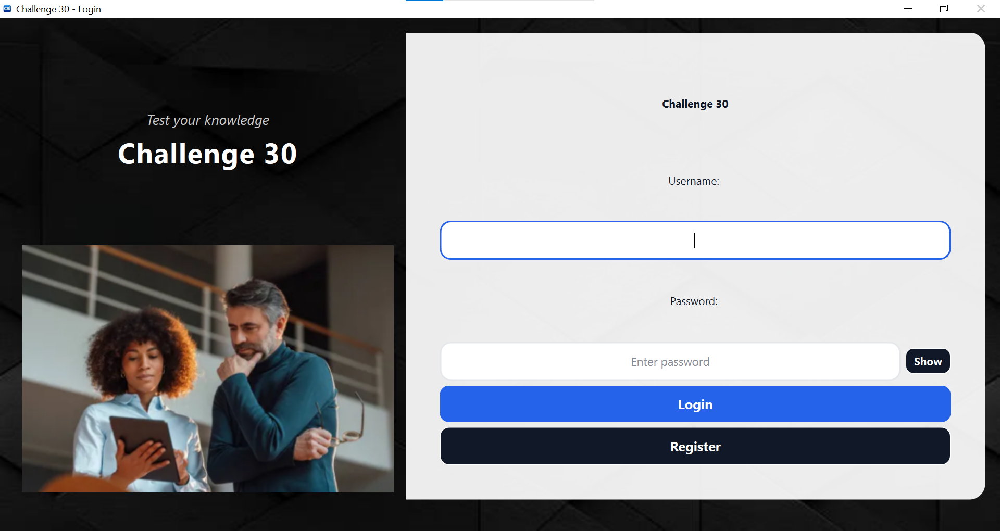
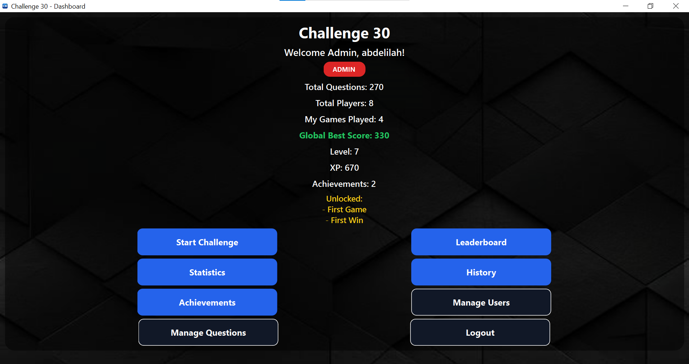
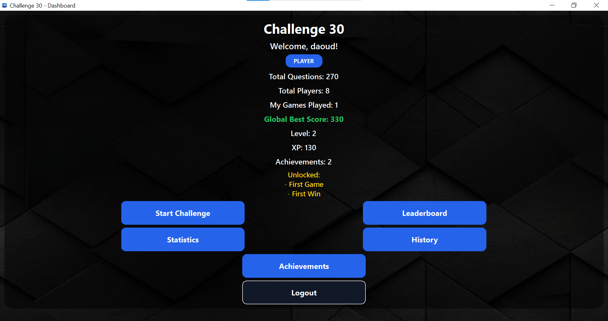
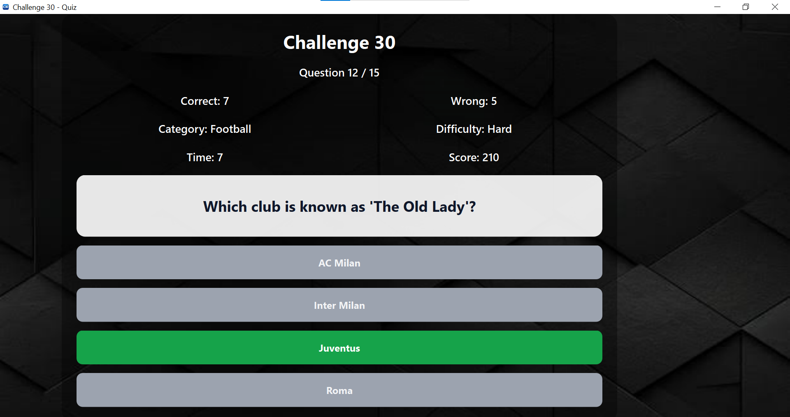
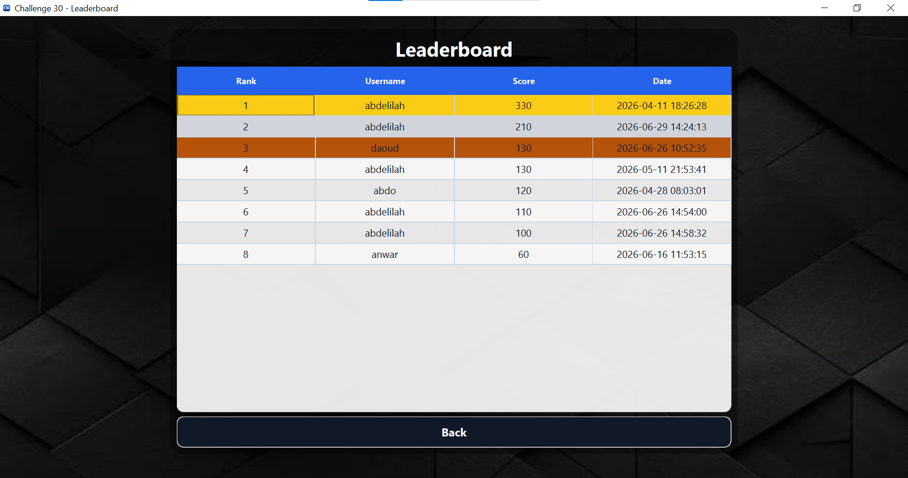

# 🎯 Challenge30 — Interactive Quiz Desktop Application

<p align="center">
  
</p>

<p align="center">
  
  
  
  
  
</p>

---

## 📌 About

**Challenge30** is a gamified quiz desktop application built with **Qt 6 and C++**.  
It features secure authentication, multiple quiz categories and difficulty levels, a progression system with XP and levels, achievements, a global leaderboard, and a full admin panel.

Developed as a personal academic project at **ENSA Al Hoceima (ENSAH)**, it goes beyond course requirements to deliver a complete, polished desktop experience.

---

## 📸 Screenshots

### 🔐 Login Screen
<p align="center">
  
</p>

### 🎮 Dashboard — Admin View
<p align="center">
  
</p>

### 👤 Dashboard — Player View
<p align="center">
  
</p>

### ❓ Quiz Screen
<p align="center">
  
</p>

### 🏆 Leaderboard
<p align="center">
  
</p>

---

## ✨ Features

### 👤 Authentication
- User **registration and login**
- Passwords secured with **SHA-256 hashing + random salt**
- Toggle password visibility on login screen

### 🎮 Quiz & Challenge
- Multiple **categories** and **difficulty levels** (Easy / Medium / Hard)
- Real-time **score tracking** and **timer** per question
- **Sound effects** for correct answers, wrong answers, and finish (via QtMultimedia)
- 15 questions per challenge session

### 📈 Progression System
- **XP points** earned after each game
- **Level-up system** based on cumulative XP
- Player progress tracked persistently in the database

### 🏆 Achievements
- **Unlockable achievements** based on milestones (first game, first win, etc.)
- Achievement unlock date displayed in the achievements panel

### 📊 Statistics & History
- Detailed **personal statistics** with charts (QtCharts)
- Full **game history** with category, difficulty, score, and date
- **Global leaderboard** ranking all players by score (🥇 gold / 🥉 bronze highlights)

### 🛠️ Admin Panel
- **Question Manager**: add, edit, delete quiz questions (with category, difficulty, 4 options, correct answer)
- **User Manager**: view all users, change roles, delete accounts
- Role-based access: `admin` vs `player`

---

## 🔧 Tech Stack

| Layer | Technology |
|-------|-----------|
| Language | C++ 17 |
| UI Framework | Qt 6 (Widgets, Charts, Multimedia) |
| Database | SQLite via Qt SQL module |
| Build System | CMake 3.19+ |
| Security | SHA-256 + Salt (custom implementation) |
| IDE | Qt Creator |

---

## 🗂️ Project Structure

```
Challenge30/
├── main.cpp                     # Entry point
├── mainwindow.*                 # Login window
├── registerdialog.*             # Registration dialog
├── dashboardwindow.*            # Main dashboard after login
├── challengewindow.*            # Quiz/challenge screen
├── resultdialog.*               # Result after quiz
├── startchallengedialog.*       # Category & difficulty selection
├── leaderboardwindow.*          # Global leaderboard
├── statisticswindow.*           # Personal statistics & charts
├── historywindow.*              # Game history
├── achievementswindow.*         # Achievements panel
├── questionmanagerwindow.*      # Admin: manage questions
├── addquestiondialog.*          # Admin: add/edit question dialog
├── usermanagerwindow.*          # Admin: manage users
├── databasemanager.*            # All database logic (SQLite)
├── soundmanager.*               # Sound effects manager
├── style.qss                    # Global stylesheet
├── resources.qrc                # Qt resource file
├── images/                      # App images & icons
├── sounds/                      # WAV sound effects
├── screenshots/                 # App screenshots
└── CMakeLists.txt               # Build configuration
```

---

## 🚀 Getting Started

### Prerequisites
- [Qt 6.5+](https://www.qt.io/download) with the following modules:
  - `Qt::Widgets`
  - `Qt::Sql`
  - `Qt::Multimedia`
  - `Qt::Charts`
- CMake 3.19+
- A C++17 compatible compiler (MinGW 64-bit recommended on Windows)

### Build & Run

```bash
# Clone the repository
git clone https://github.com/ELYOUNOUSSIAbdelilah/Challenge30.git
cd Challenge30

# Configure with CMake
cmake -B build -DCMAKE_BUILD_TYPE=Debug

# Build
cmake --build build

# Run
./build/Challenge30
```

Or simply open the project in **Qt Creator** and click **Run** ▶️

---

## 👨‍💻 Author

**Abdelilah El Younoussi**  
Computer Engineering Student — ENSA Al Hoceima (ENSAH)  
Université Abdelmalek Essaâdi

[](https://www.linkedin.com/in/abdelilah-elyounoussi-77b335333/)
[](https://github.com/ELYOUNOUSSIAbdelilah)

---

## 📄 License

This project is open source and available under the [MIT License](LICENSE).
